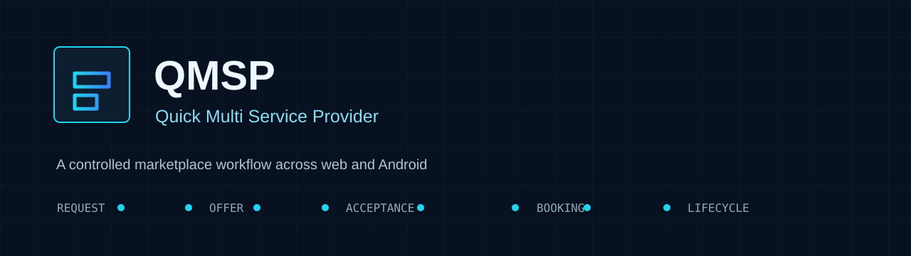
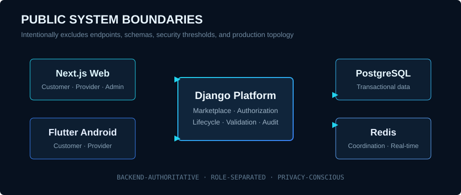

<p align="center">
  
</p>

# QMSP - Quick Multi Service Provider

**A privacy-conscious engineering case study for a multi-platform local-services marketplace.**

> This public repository documents the problem, workflow, architectural boundaries, technology choices, and selected engineering evidence. The complete implementation, internal contracts, operational configuration, security controls, and production data remain private.

## Product Problem

Customers need a structured way to find suitable local service providers, compare proposals, coordinate an appointment, and maintain accountability through the work lifecycle.

Providers need a controlled channel for receiving relevant requests, submitting transparent offers, and managing assigned work without bypassing customer choice.

QMSP brings those needs into one role-separated workflow across web and Android experiences.

## Core Marketplace Workflow

```text
Customer service request
        |
        v
Eligible provider offer
        |
        v
Customer reviews and accepts one offer
        |
        v
Booking is created
        |
        v
Authorized booking lifecycle
```

Selecting a provider does **not** create a booking. A booking is created only after the customer accepts a provider offer.

QMSP supports:

- **Open requests:** eligible providers may review the opportunity and submit offers.
- **Direct requests:** one selected provider may submit an offer or decline.
- **Customer-controlled acceptance:** the customer chooses whether an offer becomes a booking.
- **Role-specific lifecycle actions:** customer, provider, and administrative responsibilities stay separated.

## My Contribution

**Project architect and lead developer**

My work covers:

- Marketplace domain modeling and request-to-booking architecture
- Backend API design and transaction-safe lifecycle rules
- Customer, provider, and administrative authorization boundaries
- Next.js web application and same-origin backend-for-frontend integration
- Flutter Android customer and provider experiences
- Input validation and privacy-aware data contracts
- OTP-controlled service authorization
- Authorized journey tracking boundaries
- Automated regression coverage
- Container and reverse-proxy deployment preparation

AI-assisted development tools, including Codex, supported coding, debugging, and workflow execution. Project ownership, requirements, architecture, implementation direction, testing decisions, integration, and deployment decisions remained my responsibility.

## High-Level System

<p align="center">
  
</p>

The public diagram deliberately shows only broad system boundaries. Internal endpoints, database structure, security thresholds, and deployment topology are excluded.

## Technology Foundation

| Layer | Technologies |
| --- | --- |
| Backend | Python, Django, Django REST Framework, ASGI |
| Web | Next.js, React, TypeScript |
| Mobile | Flutter, Dart, Android |
| Data and Coordination | PostgreSQL, Redis |
| Real-Time Capability | WebSockets and authorized tracking updates |
| Delivery | Docker, Nginx, HTTPS-oriented production packaging |
| Quality | Backend, web, and mobile automated test suites |

## Engineering Areas

### Marketplace Integrity

- Request -> offer -> customer acceptance -> booking is enforced as the authoritative path.
- Direct provider selection does not bypass offer acceptance.
- Booking creation and lifecycle transitions are protected against stale or duplicate actions.

### Authorization

- Customer, provider, and administrative capabilities are separated.
- Server-side checks remain authoritative even when a client hides an unavailable action.
- Direct requests are restricted to the selected provider.

### Booking Lifecycle

```text
Confirmed -> Provider on the way -> Arrived -> In progress -> Completed
```

Lifecycle controls are state-aware, and completion remains separate from payment settlement.

### Privacy and Security

- Sensitive credentials and tokens are not exposed to browser JavaScript.
- OTP values are short-lived and handled outside ordinary booking data.
- Precise journey location is limited to authorized booking stages.
- Private verification evidence is excluded from public provider information.
- Backend validation protects workflows when client-side validation is bypassed.
- Security-relevant failures can be audited without recording sensitive payloads.

### Explainable Intelligent Features

- Rule-based preview services estimate price ranges from verified catalogue and marketplace factors.
- Provider recommendations use explainable scoring signals from authorized marketplace data.
- These foundations are not presented as trained machine-learning systems.

### Multi-Platform Experience

- Customers can create requests, review offers, and follow booking progress.
- Providers can manage services, offers, journeys, arrivals, and work progression.
- Web and Android clients share backend-authoritative rules while using platform-appropriate interfaces.

## Engineering and Research Opportunities

These are future directions, not claims about completed functionality:

- Privacy-preserving provider matching
- Robust anomaly detection for marketplace abuse
- Explainable trust signals for customers and providers
- Secure computer-vision support for service verification
- Resilient real-time coordination under unreliable connectivity
- Fairness and bias evaluation in provider discovery

## Evidence Planned for This Case Study

Only sanitized, non-sensitive evidence will be added:

- Public-safe interface captures with synthetic data
- High-level lifecycle diagrams
- Test summaries without internal security thresholds
- Architecture decisions with trade-offs
- Accessibility and privacy design notes
- Deployment lessons that do not disclose production infrastructure

## Public Source Policy

The complete QMSP source code is private because it contains commercially sensitive workflow design and security-relevant implementation details.

This public repository does **not** include:

- Application source code
- Internal API specifications
- Database schemas or migrations
- Security thresholds or anti-abuse logic
- Production infrastructure details
- Credentials, signing material, or environment files
- Real user, provider, location, or verification data
- Confidential roadmap material

See [Architecture Overview](./docs/architecture-overview.md) for the intentionally high-level public description.

## Project Status

QMSP is an actively developed software-engineering project. Public documentation is published selectively after privacy and security review.

## Author

**Fawad Ihsan**

- GitHub: [github.com/ihsanmand](https://github.com/ihsanmand)
- LinkedIn: [Fawad Ihsan](https://www.linkedin.com/in/fawad-ihsan-32dm)

